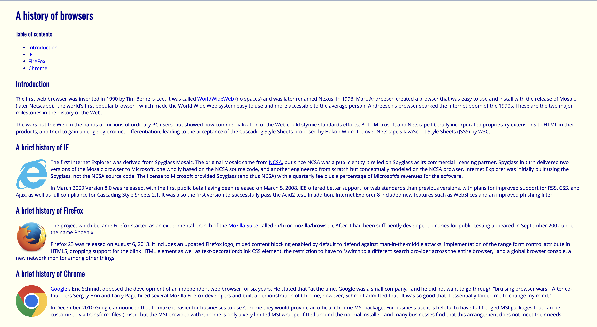
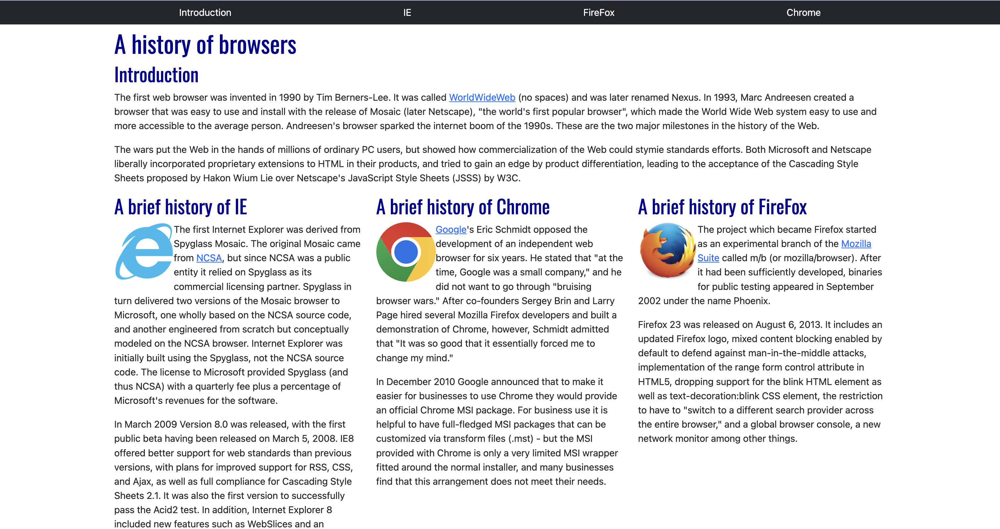

# Taking a Break From Algorithms

Before taking this course, I primarily learned and exercised backend engineering with very little experience in user interface (UI) development. However, I was always curious about web development after observing the tasks the front-end engineers were working on during my previous internship. Although I do not consider myself an artistic or creative person, I am a visual learner, and the thought of coding something that can be visualized excites me. Going into ICS 314, I looked forward to this unit the most because I could finally take a break from algorithms and let my creativity flow. 

# HTML, CSS, and UI Frameworks

Learning HyperText Markup Language (HTML) and Cascading Style Sheets (CSS) is honestly not the most difficult thing in the world, but it takes patience and getting used to it. The language and syntax are completely different from programming languages such as JavaScript or Python, but it is fairly straightforward. However, the issue with HTML and CSS is that it can get very messy, complicated, and tedious to write. This is where UI frameworks such as Bootstrap 5 come in to aid the process of UI development using HTML and CSS.

UI framework is a collection or package of libraries and design elements that contain pre-built components, speeding up the development process. With UI frameworks, developers can reduce their time writing tedious code in HTML and CSS because most of the styling is already done or provided by the framework. In ICS 314, we were instructed to use Bootstrap 5 as our UI framework to easily create components such as columns, navigation bars, dropdown menus, and even clickable icons.  

# Interlude: The Learning Curve

With learning anything new, there is always a learning curve. Learning and using HTML and CSS to create simple websites were complicated enough, but incorporating Bootstrap 5 seemed even more complicated at first. It is obvious that Bootstrap 5 is an extremely powerful and advantageous tool, however, I was honestly overwhelmed by the complexity of using the framework. After practicing using Bootstrap to create columns that were much more complicated and tedious to style with just raw HTML and CSS, I started to become more curious about the potential of using Bootstrap 5. After doing a quick Google search on Bootstrap 5, I found an absurd amount of documentation on the different styling and components that are available to be implemented using the framework. Although I am still learning and getting used to using Bootstrap 5, I think the amount of time I am spending is a good investment for how convenient styling becomes, considering how tedious coding raw HTML and CSS can get. 

# Aesthetic Comparison and Examples

Although it is probably possible to create aesthetically pleasing, beautiful websites with just raw HTML and CSS, it is much easier and time efficient to use Bootstrap 5. Below is a comparison of a website using raw HTML and CSS (left) and Bootstrap 5 (right).

  
  

I am especially proud of my recreation of the Be:Lift website using Bootstrap 5. The real website is shown on the left and my recreation is shown on the right. 

  
  

Before experiencing UI development, I was mostly interested in backend engineering. However, after creating a handful of websites using HTML, CSS, and UI frameworks such as Bootstrap 5, I have started to become interested in frontend engineering as well. I plan to explore and experiment with what I can create with Bootstrap 5 and hope to incorporate my improved skills soon. 
