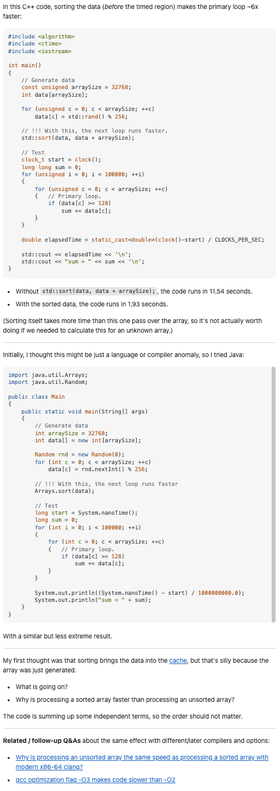

## Overcoming Anxiety
No matter what career, asking questions holds a significant value as it allows one to clear up any confusion and gain insight. As a software engineer, asking questions to gain more knowledge can help with code optimization, thus saving more time and overall becoming a better programmer. As an introvert, however, I do not like asking questions and often find myself avoiding them by attempting to answer my own questions. For me, asking is an anxiety-filled, overwhelming task as I fear the humiliation I may experience. However, I realized over time that I can overcome my anxiety if I ask efficient and effective questions. 

## One Question For All—Stack Overflow
More often than not, many people have similar questions. I realized this when it occurred to me multiple times when I would ask my friend a question about a certain topic or concept. Hoping for some clarification, my friend would reply with, “I was wondering the same thing too.” Asking good questions would not only benefit me but others who are struggling with the same topic as well. [Stack Overflow](https://stackoverflow.com/) is a place where developers can ask or answer questions, and others can view the discussion to help with their problems or questions. 

To receive a rapid, quality answer to a question on Stack Overflow, the question must be meaningful for responders to spend their valuable time on. Before posting a question, it is highly recommended that research is conducted to avoid redundancy. Even if there were no answers found after searching for similar questions on Stack Overflow or other resources, it is good practice to share that research was done, as it indicates effort and willingness to learn. Questions should be posted to its appropriate and relevant forum, free of grammar and spelling errors. Headers should be professional, appropriate, and specific to the topic in question, and the question should be as informative, precise, and specific as possible. Assumptions or guesses must not be made, as any indication of incompetency should be avoided. Overall, "smart" questions posted on Stack Overflow should be precise, specific, professional, and demonstrating knowledge and understanding of the topic.

## Not So Smart Questions
To understand how to ask "smart" questions, we must understand what kinds of questions to avoid asking. An example of a poorly asked question is [“How to print “/” in Python?”](https://stackoverflow.com/questions/32491682/how-to-print-in-python). 


In this example, the user simply asks, “How to get string / ```\```?” This is not a good question for multiple reasons. First and foremost, this question grammatically does not make sense and is not very clear. Most importantly, this user could have easily found the solution to their problem by doing a quick Google search on basic escape sequences in Python. This post indicates that this user did not make the effort to find solutions on their own before asking on Stack Overflow. Although this post did receive responses, the answers were basic information that could have been found on Google. 

By reading an example of a "bad" question to ask, I learned the importance of researching and finding potential solutions and answers before jumping on Stack Overflow to ask others for help, as it could save everyone’s time and avoid displaying incompetency. Additionally, questions should be as informative, descriptive, and specific as possible so that others know exactly what issues I am experiencing and what kinds of solutions I am hoping to achieve.

## Good Questions Make You Think 
Good questions often make others think before immediately sharing an answer. An example of a good, smart question is [“Why is processing a sorted array faster than processing an unsorted array?”](https://stackoverflow.com/questions/11227809/why-is-processing-a-sorted-array-faster-than-processing-an-unsorted-array). 

In this example, the user asks why sorted data runs faster than unsorted data. To demonstrate their question, the user included a code block in C++ with comments and a short summary of their results, which was that running their code with ```std::sort(data, data + arraySize);``` included results in their code to run in almost 2 seconds, whereas without it, it ran in almost 12 seconds. The user proceeded to share that they thought it was a language or compiler issue, so they tested it with Java, which yielded similar results. A code block in Java was also provided. At the end of the post, the user includes two clear, concise, and specific questions related to their findings. Further, to wrap up the post, the user leaves two links to relevant posts in Stack Overflow to indicate they have done their research. This question is a “smart” question, as it is a challenging question that cannot be answered by a quick Google search. Moreover, the user demonstrates an understanding of the topic and provides the necessary information to help others to answer the question. 



By reading this example of a good, “smart” question, I learned how important it is to be as specific and informative as possible, as it makes it easy for everyone to clearly understand what the issue is. I especially liked how the user included a code block in both languages so that anyone can run the code on their device to observe the difference in speed when running unsorted versus sorted data. This question is a good example of a smart question that is meaningful and worth the time to answer. 
