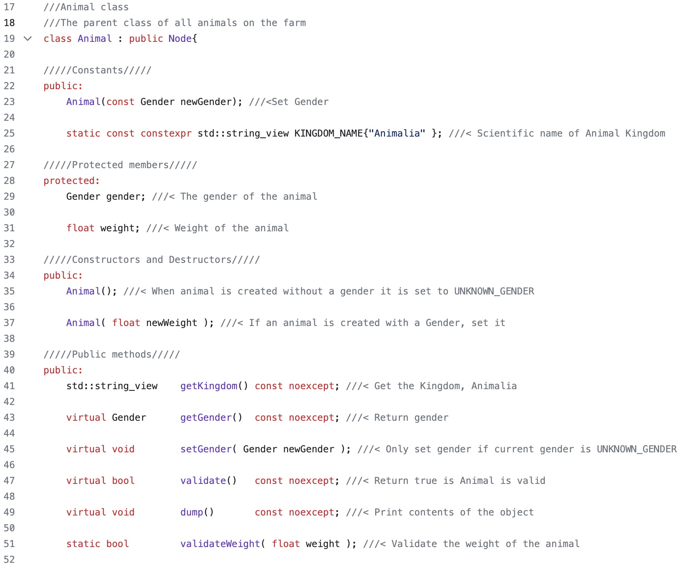
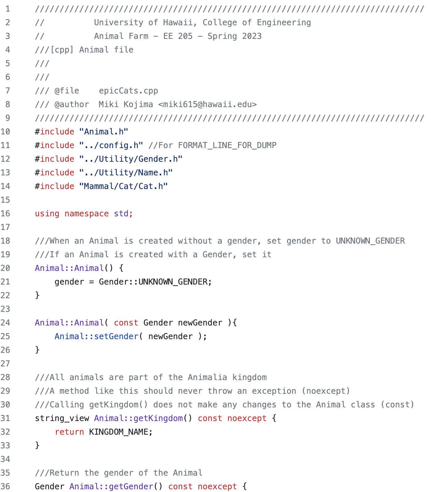

Animal Farm is a large project completed in EE 205. Each lab within the project was designed to learn and practice the basics of C and C++ and adopt good software engineering skills using tools such as Git, CLion, and the command-line. Upon the completion of each lab, students were expected to push new or updated files to GitHub. 

Throughout the Animal Farm project, I learned object-oriented programming by representing animals as objects and implementing the organization of the database in C++. I was introduced to CLion, an IDE that is extremely powerful in programming and organizing various files such as README, CMake, and Doygen documentations. I also wrote unit tests to ensure the implementations in my code works properly for every test case. 

The following is an overview of the timeline of the Animal Farm project:

| Animal Farm Lab | Description |
| --- | --- |
| Animal Farm 0 | Start the Animal Farm lab from scratch using CLion. Write a trim function and get used to Boost Tests. |
| Animal Farm 1 - Epic Cats | Add a Weekly Progress file. Create a new executable, epicCats. Create an array-based dattabase of cats. |
| Animal Farm 2 - Cat Dominion | Create an enum class for gender and a new directory, Animal. |
| Animal Farm 3 - Cat Infinitum | Create a new directory, Container. This directory contains files for Node, Container, and SingleLinkedList, which are used to store animals. |
| Animal Farm 4 - Cat Wrangler | Create a new executable, catWrangler and a new directory, Mammal. Write a compare() method for sorting of the SingleLinkedList. |
| Animal Farm 5 - Cat Empire | Create a new executable, catEmpire. Add a utility, Name. Add a speak() function and clean Animal Farm. |
| Animal Farm 6 - Cat Wall | Wrapping up Animal Farm. Create a README.md and publish everything. |

Each lab took approximately 1~2 weeks to complete and varied in difficulty. However, each lab was very meaningful as it taught valuable skills and knowledge of the C and C++ language while providing opportunities to exercise and gain experience in object-oriented programming.

Example of some of the implementations in the Animal class file:

