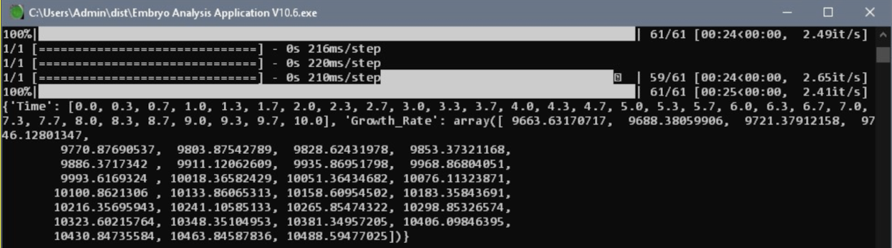

The Micro VIP is one of the vertically-integrated projects offered at UH Manoa. I joined in Spring 2023 and worked in a small team to improve the Embryo Image Analysis application that previous teams have been working on. For my team specifically, our goals were to improve the neural network and resolve the overfitting of the trophectoderm epithelium (TE) and the underfitting of the inner cell mass (ICM) and implement a logging system that helps developers debug the application. 

I primarily worked on implementing a simple logging system in Python that consists of print statements that are useful for developers to see what is occuring in the program. 

Implementation of the logging system (Python):

Example of an output on the console:

