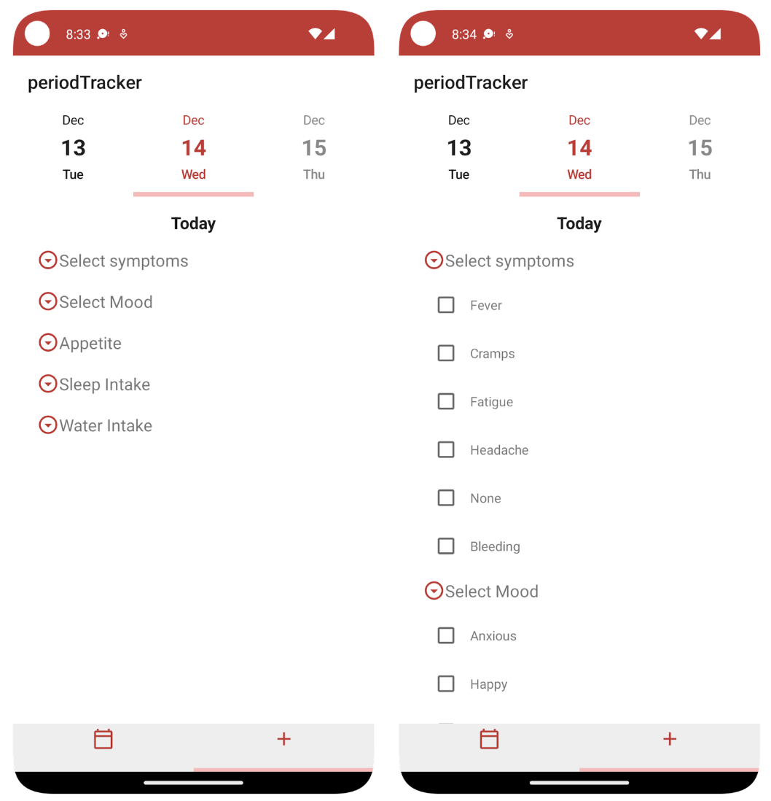
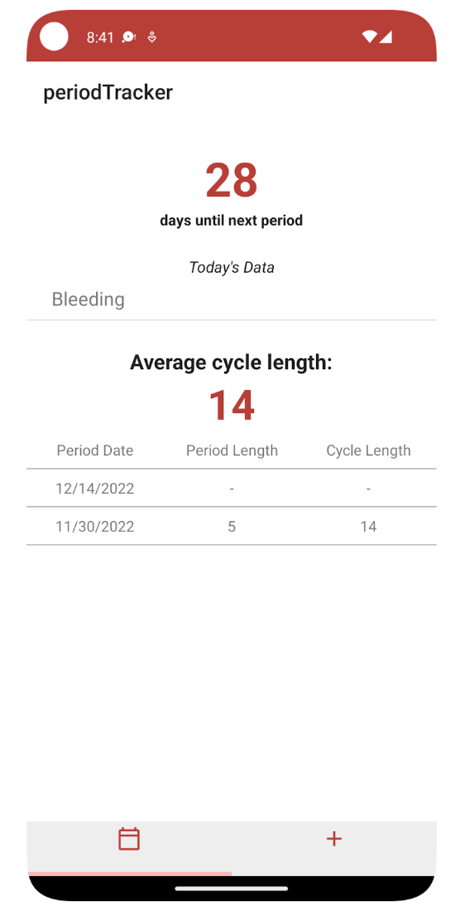

As a woman, tracking menstrual cycles are very useful and important as it helps gauge when to expect the next cycle, understand why cramps are occuring, and to look for signs of irregularity. A lot of the applications I used in the past are either too complicated to use or lacks the feautres I want. I developed a simple application that is easy to use and has the functionalities that were lacking in most applications that are on the market. Since I am passionate about fitness and health, I wanted my application to not just track my menstrual cycle, but also help me log my mood, appetite, sleep, water intake, and if I am experiencing any symptoms. 

I developed this application using Kotlin for the programming language and Android Studio for the IDE, in which I learned by going through the training on the Android Developers website. I used an open source database called Realm to update, store, and access data. 

Here are some screenshots highlighting my application:

