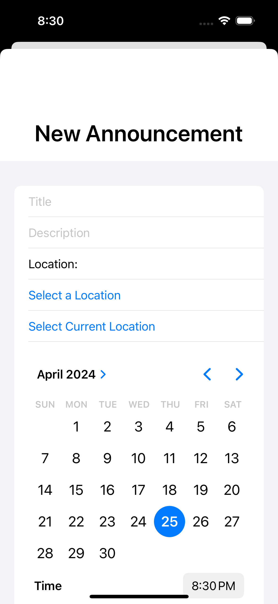
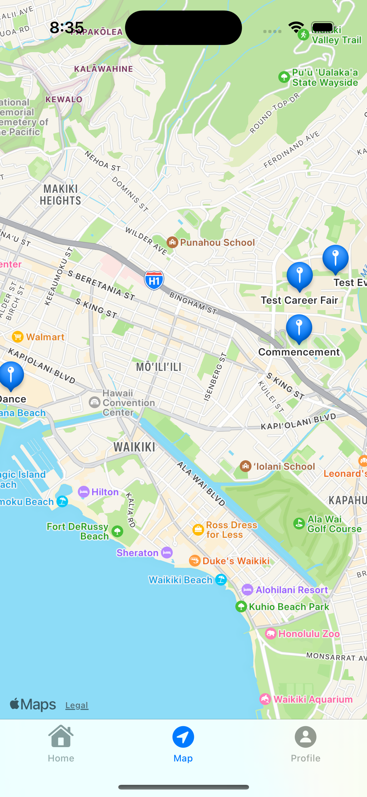
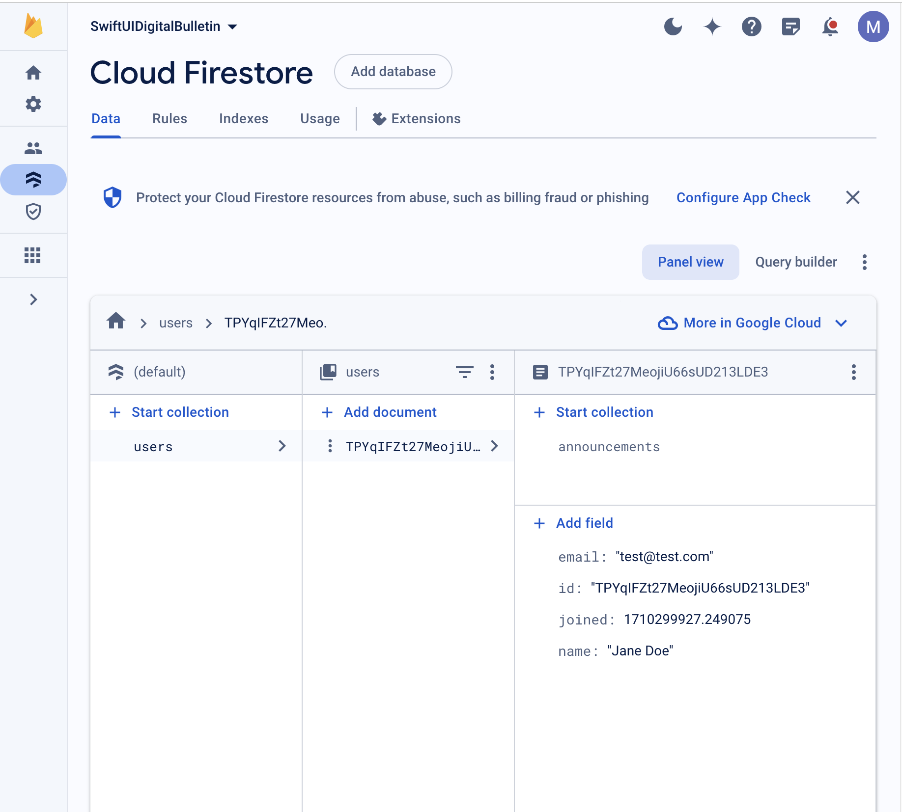

## UHM Digital Bulletin Board
On the University of Hawaii at Manoa campus, there are multiple traditional bulletin boards filled with campus-related information, such as upcoming events, advertisements of student organizations, or campus services. However, they are often crowded with flyers, making them unappealing and difficult for people to navigate. The main objective of this project was to allow users to conveniently advertise and find out about upcoming events or available services.

## Design and Features
The final design of the application consisted of a simple UI with complex features. When the application is first installed on a device, the login view is shown. Pre-existing users can use their credentials when they register to log in. New users can press the “Create an Account” link at the bottom of the page, which takes them to the register view to create an account.

  

After logging into the application or creating a new account, the user can access the home page, where all the announcements are displayed as a list. There are three tabs on the bottom to access the home page, map view, and profile page.

  

A new announcement can be made by pressing the plus button on the top right corner of the home screen. When this button is pressed, a form is displayed. To create a post, a title, description, location, and date must be entered. All fields are required and the date must be today or newer, otherwise an error message will appear.

  
  

There are two methods the location can be entered when creating a new announcement post. One way is by selecting the “Select a Location” button, which allows the user to zoom into a map and select any location by tapping. The second method is by selecting the “Select Current Location” button, which allows the user to associate their current location with the announcement post.

  
  

For both methods, the location name is displayed in the form after the user confirms their selection. This allows the user to check that their selected location is correct.

  

Once a valid announcement post has been created and saved, it gets displayed on the home. The posts are displayed as a list with the title, date, location, and description visible. The post can be deleted at any time with a simple swipe.

  

The middle tab, “Map” is a map view that displays the events that are associated with every announcement post that has been made. Each location is pinned with the announcement title for a convenient view. If an announcement is taken down, the pin on the map view is also removed and will no longer be visible.

  

The final tab is the profile view, which is a simple page that displays the user information such as the date they joined, their full name, and email address. From this page, users can log out, which takes users back to the login or landing page.

  

## Backend Design
The backend design utilized the Firebase application development service for the database and user authentication. The Firebase service is integrated in such a way that when an account is created, the information associated with the account such as the user’s full name, email address, and the date the account was created, is stored as a collection of users in the database. For each user, there is an association with another collection of items, which are the announcements. The information stored in the database for each announcement includes the date the announcement was created, description, title, a boolean that represents whether the announcement was marked as done or not, latitude and longitude of the location, and location as a string. Upon the successful creation and registration of an account and announcement, a unique identification is assigned to the user and the announcement post.

  

  

